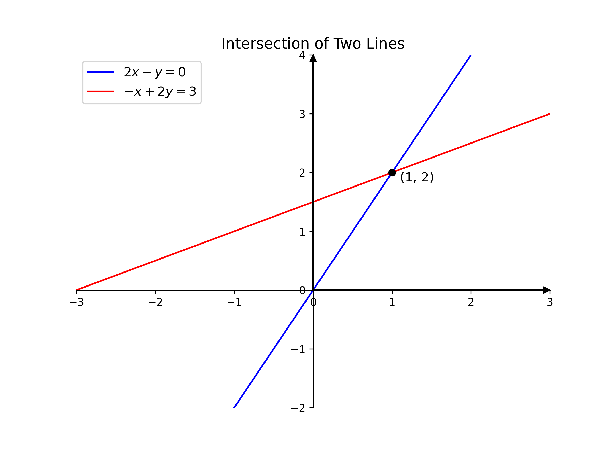
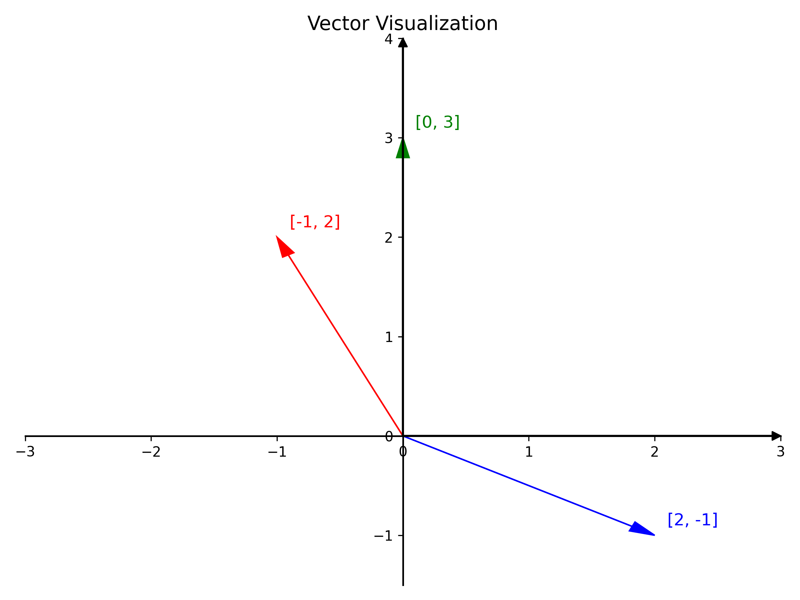

---
aliases:
  - 线性方程的几何意义
title: 第1讲 线性方程的几何意义 The geometry of linear equations
date: 2025-06-14 17:00:23
excerpt: 线性代数
tags:
  - 线性代数
---

## 第1讲  - 线性方程的几何意义 The geometry of linear equations

### 1. 知识概要

本节主要介绍 **线性代数** 的基础。学习线性代数的应用之一就是**求解复杂**的方程问题，因此本节内容就从 **解方程** 开始。

本节核心内容是从 **row picture (行图像)** 和 **column picture (列图像)** 的角度求解方程。

- **row picture**：将方程的行向量抽出来，画出其 row picture, 通过画图的的方式求出方程的解，即**行向量的交点（点积方式）**。
- **column picture**：将方程表示为 $a_1x_1 + a_2x_2 = b$，将方程转化为列向量的 **线性组合**，此时，方程的求解转换为找到 $(a_1, a_2)$，使得列向量  $(x_1, x_2)$ 正确组合得到向量 $b$。

### 2. 方程组的几何解释基础

#### 2.1 线性方程组的形式

线性代数的基本问题就是解 n 元一次方程组。例如：二元一次方程组

$$
\left\{
\begin{aligned}
2x - y &= 0 \\
-x + 2y &= 3
\end{aligned}
\right.
$$

将方程写为矩阵形式就是：

$$
\begin{bmatrix}
2 & -1 \\
-1 & 2
\end{bmatrix}
\begin{bmatrix}
x \\
y
\end{bmatrix} =
\begin{bmatrix}
0 \\
3
\end{bmatrix}
$$

其中 $A=\begin{bmatrix}2 & -1 \\-1 & 2\end{bmatrix}$ 被称为 **系数矩阵（coefficient matrix）**

未知数向量通常记为 $x=\begin{bmatrix} x \\ y \end{bmatrix}$

而等号右侧的向量记为 **b**。线性方程组记为：

$$
Ax=b
$$

#### 2.2 二维行图像

行图像遵从解析几何的描述，**每个方程在平面上的图像为一条直线**。找到符合方程的两个数组，就可以确定出坐标轴平面上的两个点，连接两点可以画出该方程所代表的直线。两直线交点即为方程组的解 $x=1,y=2$。

#### 2.3 二维列图像

在列图像中，将系数矩阵写成列向量的形式，则求解原方程变为寻找列向量的 **线性组合（linear combination）** 来构成向量**b**。

$$
x \begin{bmatrix} 2 \\ -1 \end{bmatrix} + y \begin{bmatrix} -1 \\ 2 \end{bmatrix} = \begin{bmatrix} 0 \\ 3 \end{bmatrix}
$$

**向量线性组合**是贯穿线性代数的重要概念。对于给定的向量 **c** 和 **d** 以及标量 _x_ 和 _y_ ，我们将 _x_**c**+_y_**d** 称之为 **c** 和 **d** 的一个线性组合。

从几何上讲，我们是寻找满足如下要求的 x 和 y，使得两者分别数乘对应的列向量之后相加得到向量 $\begin{bmatrix} 0 \\ 3 \end{bmatrix}$。其几何图像如下图：

可以看到当蓝色的向量乘以1与红色的向量乘以2后做加法（首尾相接）就可以得到绿色的向量，由此可得到方程的解 $x=1,y=2$。

想象一下如果任意取 x,y，则得到的线性组合又是什么？其结果就是以上两个列向量的所有线性组合将会布满整个坐标平面。

### 3.  方程组的几何解释推广

#### 3.1 高维行图像

将方程组的维数进行推广，从三维开始，给定三维矩阵如下：

**线性方程组**：

$$
\left\{
\begin{equation}
\begin{aligned}
x + 2y + 3z &= 6, \\
2x + 5y + 2z &= 4, \\
6x - 3y + z &= 2.
\end{aligned}
\end{equation}
\right.
$$

**矩阵形式**：

$$
\begin{bmatrix}
1 & 2 & 3 \\
2 & 5 & 2 \\
6 & -3 & 1
\end{bmatrix}
\begin{bmatrix}
x \\
y \\
z
\end{bmatrix} =
\begin{bmatrix}
6 \\
4 \\
2
\end{bmatrix}.
$$

方程的行图像比较复杂，每一个方程都是三维空间内的一个平面，解为三个平面的交点。

想直接看出这个点的性质比较难，常用思路是先联立其中两个平面，使其相交于一条直线，再研究这条直线与平面相交于哪个点，最后得到点坐标即为方程的解。这个求解过程对于三维来说或许还算合理，那四维呢？五维甚至更高维数呢？直观上很难直接绘制更高维数的图像。

#### 3.2 高维列图像

由线性组合可得：

$$
x \begin{bmatrix} 1 \\ 2 \\ 6 \end{bmatrix} + y \begin{bmatrix} 2 \\ 5 \\ -3 \end{bmatrix} + z \begin{bmatrix} 3 \\ 2 \\ 1 \end{bmatrix} = \begin{bmatrix} 6 \\ 4 \\ 2 \end{bmatrix}.
$$

之所以我们**更推荐使用列图像**求解方程，是因为这是一种更系统的求解方法，即寻找线性组合，而不用绘制每个行方程的图像之后寻找那个很难看出来的点。

另外一个优势在于，如果改变等号右侧的 b 的数值，那么对于行图像而言三个平面都改变了。**而对于列图像而言，三个向量并没有发生变化，只是需要寻找一个新的组合。**

### 4. 矩阵乘法

已知矩阵 A 和向量 x，求解它们的积：

$$
A = \begin{bmatrix} 
2 & 5 \\ 
1 & 3 
\end{bmatrix}, \quad x = \begin{bmatrix} 
1 \\ 
2 
\end{bmatrix}.
$$

- **列图像**：$Ax$ 是矩阵 A 列向量的线性组合 ：
  $$
  \begin{bmatrix} 
	2 & 5 \\ 
	1 & 3 
	\end{bmatrix}
	\begin{bmatrix} 
	1 \\ 2 
	\end{bmatrix}= 1 \begin{bmatrix} 
	2 \\ 1 
	\end{bmatrix} + 2 \begin{bmatrix} 
	5 \\ 
	3 
	\end{bmatrix}
	= \begin{bmatrix} 
	12 \\ 
	7 
	\end{bmatrix}.
  $$
- **行图像**：将矩阵 A 的行向量和 x 向量进行点积来计算：
  $$
  \begin{bmatrix} 
2 & 5 \\ 
1 & 3 
\end{bmatrix}
\begin{bmatrix} 
1 \\ 
2 
\end{bmatrix}
=
\begin{bmatrix} 
1 \times 2 + 2 \times 5 \\ 
1 \times 1 + 2 \times 3 
\end{bmatrix}
=
\begin{bmatrix} 
12 \\ 
7 
\end{bmatrix}.
  $$

### 5. 线性无关

> 问题：**是否对于所有的 b，方程 Ax=b 都有解？**

从列图像上看，问题转化为 **列向量的线性组合是否覆盖整个三维空间？**

**反例**：若三个向量在同一平面内，比如三个列向量分别为：

$$
\begin{bmatrix} 2 \\ -1 \\ 0 \end{bmatrix}, \quad \begin{bmatrix} -1 \\ 2 \\ -3 \end{bmatrix}, \quad \begin{bmatrix} 1 \\ 1 \\ -3 \end{bmatrix}.
$$

其中 $\begin{bmatrix} 1 \\ 1 \\ -3 \end{bmatrix}=\begin{bmatrix} 2 \\ -1 \\ 0 \end{bmatrix}+ \begin{bmatrix} -1 \\ 2 \\ -3 \end{bmatrix}$，这三个向量构成了一个平面。矩阵 $A = \begin{bmatrix} 2 & -1 & 1 \\ -1 & 2 & 1 \\ 0 & -3 & -3 \end{bmatrix}$ 构成的方程 $Ax=b$ 中 b 无法覆盖整个三维空间，**即 b 不在该平面内，三个列向量无论怎么组合也得不到平面外的向量 b**。
 
此时，矩阵 A 为**奇异阵**或称**不可逆矩阵**。在矩阵 A 不可逆条件下，不是所有的 b 都能令方程 Ax=b 有解。

对n维情形则是，n个列向量如果相互独立，即 **线性无关** 则方程组有解。否则这n个列向量起不到n个的作用，其线性组合无法充满n维空间，方程组未必有解。

从行图像的角度来看，三元方程组是否有解意味着什么？

- 当方程所代表的三个平面相交于一点时方程有**唯一解**
- 三个平面中至少两个平行则方程**无解**
- 平面的两两交线互相平行方程也**无解**
- 三个平面交于一条直线则方程有**无穷多解**

具体的示意图如下所示：

### 6. 小结

这部分内容是对线性代数概念的初涉。从解方程谈起，行空间逐步过渡到列空间，可以将解方程问题转化为求列向量的线性组合。最后，介绍了矩阵乘法，以及线性无关的概念。
