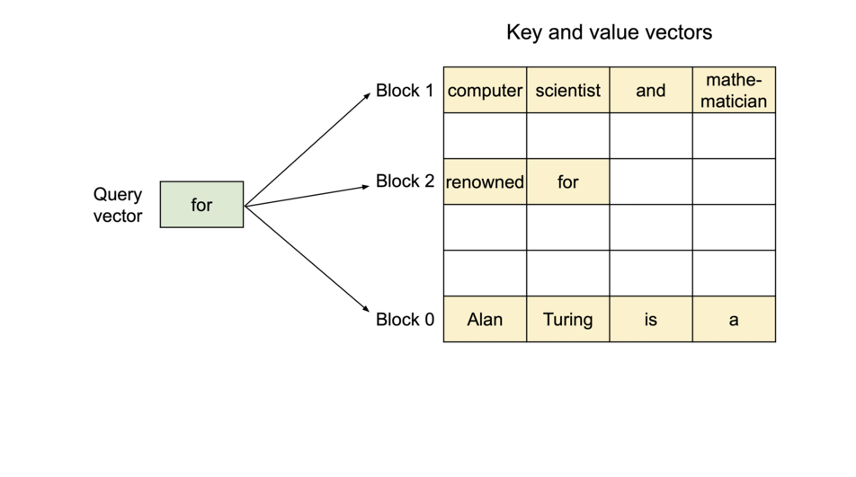

---
aliases:
  - Efficient Memory Management for Large Language Model Serving with PagedAttention
  - VLLM
Authors: Woosuk Kwon, Zhuohan Li, Siyuan Zhuang, Ying Sheng, Lianmin Zheng, Cody Hao Yu, Joseph E. Gonzalez, Hao Zhang, Ion Stoica
Year: 2023
Title: Efficient Memory Management for Large Language Model Serving with PagedAttention
DOI: 10.48550/arXiv.2309.06180
tags:
  - 大模型推理
  - 模型推理
  - 分页缓存
---

## Efficient Memory Management for Large Language Model Serving with PagedAttention

- **网址链接:** [Open online](http://arxiv.org/abs/2309.06180)
- **作者:** Woosuk Kwon, Zhuohan Li, Siyuan Zhuang, Ying Sheng, Lianmin Zheng, Cody Hao Yu, Joseph E. Gonzalez, Hao Zhang, Ion Stoica
- **引用:** Kwon2023
- **本地pdf:** [2023-Efficient Memory Management for Large Language Model Serving with PagedAttention](../../../../../asset/papers/2023-Efficient%20Memory%20Management%20for%20Large%20Language%20Model%20Serving%20with%20PagedAttention.pdf)

### Abstract

为了实现大型语言模型（LLMs）的高吞吐量服务，需要一次性批处理足够多的请求。然而，现有系统面临挑战，因为每个请求的**键值缓存（KV cache）内存占用巨大**，并且会动态增长和缩减。如果管理不善，这种内存可能会因碎片化和冗余复制而显著浪费，从而限制了批处理规模。为了解决这一问题，我们提出了**PagedAttention**，这是一种**受操作系统经典虚拟内存和分页技术启发的注意力算法**。在此基础上，我们构建了vLLM，一个LLM服务系统，它实现了以下目标：(1) KV缓存内存的接近零浪费；(2) 在请求内部和跨请求之间灵活共享KV缓存，以进一步减少内存使用。我们的评估表明，与FasterTransformer和Orca等最先进的系统相比，vLLM在相同延迟水平下将流行LLMs的吞吐量提高了2到4倍。对于更长的序列、更大的模型和更复杂的解码算法，这种改进更为显著。vLLM的源代码已在[此处](https://github.com/vllm-project/vllm)公开提供。
### Summary

vLLM 提出了一种基于**PagedAttention**的大语言模型（LLM）服务内存管理框架，通过**借鉴操作系统的虚拟内存分页机制**，显著提升了KV Cache的内存利用率，从而实现了**吞吐量提升24倍、延迟降低2-4倍、内存利用率从传统方案的<20%提升至>87%** 的效果。PagedAttention将请求的键值缓存（KV缓存）划分为多个块，每个块可容纳固定数量词元的注意力键和值，无需存储在连续内存空间，因此可以像操作系统的虚拟内存一样管理KV缓存：**将块视为页，词元视为字节，请求视为进程**。

该框架不仅解决了传统LLM服务中的内存碎片化问题，还支持动态批处理和并行采样，同时保持了与主流框架（如HuggingFace）的兼容性。

**优点**：

- 提出了PagedAttention，一种**非连续KV Cache存储方案**，内存浪费降低超过90%，支持更长的序列长度，有效解决内存碎片化问题
- 支持**动态批处理+并行采样**，显著提升吞吐量
- 通过多场景评估，验证了vLLM显著优于FasterTransformer[31]和Orca[60]等现有最优解决方案。

**缺点**：

- 对非连续请求序列的优化效果待验证
- 未明确量化分页机制的计算开销
- 极端长度序列（>16k tokens）的处理能力未充分验证
### ResearchObjective

vLLM的研究目标是解决传统LLM服务中KV Cache内存管理低效导致的**高延迟、低吞吐量**问题。通过改进内存分配机制，vLLM旨在提升LLM服务的效率，特别是在动态批处理和并行采样等复杂场景下。
### Background

#### 1. LLM核心机制

基于自回归Transformer架构的LLM通过迭代生成机制工作[53]：模型基于输入提示词（prompt）和已生成的输出序列，**按词元（token）逐步生成文本**。每次推理需持续生成直至终止符出现，此过程导致两个关键瓶颈：

- **显存容量限制**：动态生成的KV缓存持续占用显存，制约批处理规模
- **计算资源利用率低下**：GPU算力受限于内存带宽和调度效率
#### 2. 内存分配现状

以130亿参数模型在40GB A100 GPU上的部署为例（图1左）：

- **静态模型权重**：占用65%显存（约26GB）
- **动态KV缓存**：占用30%显存（约12GB），利用率仅20.4%-38.2%
- **闲置内存**：约20%显存未被有效利用

#### 3. 连续内存预分配问题

由于模型权重是固定的，而激活值仅占用GPU内存的一小部分，因此KV缓存的管理方式对确定最大批处理规模至关重要。如图1（右）所示，LLM主要将请求的**KV缓存**存储在连续的内存空间中，而大多数深度学习框架 [33, 39] 要求**张量**存储在连续内存中。与传统深度学习工作负载中的张量不同，KV缓存具有独特的特性：它会随着模型生成新token而动态增长和收缩，其生命周期和长度无法预先确定。这些特性使得现有系统的方法在以下两方面效率低下：

**内存碎片化**：

- **内部碎片**：预分配最大长度（如2048词元）与实际使用长度不匹配（图1右），即使已知序列长度，由于整个内存块在请求的生命周期内被保留，其他较短的请求无法利用当前未使用的部分，内存使用效率仍然较低。
- **外部碎片**：不同请求预分配块大小不一，无法共享未使用内存。实际KV缓存利用率仅20.4%-38.2%

**内存共享限制**：  

高级解码算法需要多输出分支（如并行采样生成5个候选结果），但传统连续存储方案导致：

- KV缓存块相互隔离，无法共享公共前缀（如提示词部分）
- 每个候选序列独立存储重复内容，显存消耗线性增长
### Methods

vLLM的架构如图4所示，使用集中式调度器协调分布式GPU工作节点的执行。KV缓存管理器通过PagedAttention实现了分页式的高效KV缓存管理，
根据集中式调度器发送的指令，管理GPU工作节点上的物理KV缓存内存。

#### 1. PagedAttention

**传统注意力算法**

语言建模的核心任务是对一系列词元 $(x_1, \ldots, x_n)$ 的概率分布进行建模。鉴于语言具有天然的序列特性，通常将整个序列的联合概率分解为条件概率的乘积（即自回归分解[3]）：

$$
P(x) = P(x_1) \cdot P(x_2 | x_1) \cdots P(x_n | x_1, \ldots, x_{n-1}).
$$

Transformer模型[53]已成为大规模建模上述概率分布的实际标准架构。Transformer语言模型中最关键的组件是其自注意力层。对于输入隐藏状态序列 $(x_1, \ldots, x_n) \in \mathbb{R}^{n \times d}$，自注意力层首先对每个位置 $i$ 应用线性变换，得到查询（query）、键（key）和值（value）向量：

$$
q_i = W_q x_i, \quad k_i = W_k x_i, \quad v_i = W_v x_i.
$$

随后，自注意力层通过将某一位置的查询向量与之前所有位置的键向量相乘，计算注意力分数 $a_{ij}$，并将输出 $o_i$ 计算为值向量的加权平均：

$$
a_{ij} = \frac{\exp(q_i^\top k_j / \sqrt{d})}{\sum_{t=1}^i \exp(q_i^\top k_t / \sqrt{d})}, \quad o_i = \sum_{j=1}^i a_{ij} v_j.
$$

除了上述公式中的计算外，Transformer模型中的其他组件，包括嵌入层、前馈层、层归一化[2]、残差连接[22]、输出logit计算，以及公式(2)中的查询、键和值变换，均以位置独立的形式 $y_i = f(x_i)$ 应用。

**PagedAttention**

与传统注意力算法不同，PagedAttention允许将连续的键值对存储于非连续的内存空间中，通过**将每个序列的KV缓存划分为多个KV块**，每个块包含固定数量词元的键值向量，称之为KV块大小（𝐵）。定义键块 $𝐾𝑗 = (𝑘_{(𝑗−1)(𝐵+1)}, ..., 𝑘_{𝑗𝐵})$ 和值块 $𝑉𝑗 = (𝑣_{(𝑗−1)(𝐵+1)}, ..., 𝑣_{𝑗𝐵})$。公式4中的注意力计算可转化为以下分块计算形式：

$$
𝐴𝑖𝑗 = \frac{\exp(𝑞^⊤_𝑖 𝐾𝑗 / \sqrt{𝑑})}{\sum_{𝑡=1}^{\lceil𝑖/𝐵\rceil} \exp(𝑞^⊤_𝑖 𝐾𝑡1 / \sqrt{𝑑})}, \quad 𝑜𝑖 = \sum_{𝑗=1}^{\lceil𝑖/𝐵\rceil} 𝑉𝑗 𝐴^⊤_{𝑖𝑗},
$$

其中，$𝐴𝑖𝑗 = (𝑎_{𝑖,(𝑗−1)(𝐵+1)}, ..., 𝑎_{𝑖,𝑗𝐵})$ 表示第𝑗个KV块上的注意力分数行向量。图5展示了PagedAttention的一个示例：键值向量分布在三个块中，且这些块在物理内存中并不连续。每次计算时，内核将查询词元（如“forth”）的查询向量𝑞𝑖与某个块中的键向量𝐾𝑗（例如块0中的“Four score and seven”键向量）相乘，计算注意力分数𝐴𝑖𝑗，随后将𝐴𝑖𝑗与该块中的值向量𝑉𝑗相乘，得到最终的注意力输出𝑜𝑖。**即一维向量转二维向量的过程**

|                               静态图                               |                               动态图                                |
|:------------------------------------------------------------------:|:-------------------------------------------------------------------:|
|  |  |

#### 2. KV缓存管理器

vLLM内存管理器的核心理念与操作系统的虚拟内存类似。操作系统将内存分成大小相同的“页”，然后把程序的逻辑页映射到实际的物理内存页上。这样，即**使逻辑页是连续的，物理内存也可以不连续**，这样用户程序就像访问连续内存一样使用内存。同时，操作系统不需要在程序运行前就把所有物理内存预先分配好，而是可以根据需求动态分配。

vLLM借鉴了这种虚拟内存的管理方案，用来管理LLM（大型语言模型）服务中的KV缓存（键值缓存）。在PagedAttention的帮助下，KV缓存被组织成固定大小的KV块，就像虚拟内存里的页一样。当有新数据（令牌）生成时，这些KV块会从左到右逐步填充，而最后一个KV块中未填充的地方则为将来的数据保留。

在GPU工作节点上，块引擎会分配一块连续的GPU内存（DRAM），并将其分割成物理KV块，此外在CPU内存中也进行类似的操作。这些KV块的管理是由KV块管理器负责的，它维护一个“块表”，记录逻辑KV块与物理KV块之间的关系，以及每个物理块中已填充的数据位置数量。

#### 3. 使用PagedAttention和vLLM进行解码

接下来，我们通过图6中的示例，详细说明vLLM如何在解码过程中使用PagedAttention并管理内存。以下是具体步骤：

|                                静态图                                 |                                 动态图                                 |
| :----------------------------------------------------------------: | :-----------------------------------------------------------------: |
|  |  |

1. **初始内存分配**：与操作系统的虚拟内存类似，vLLM不需要一开始就为可能生成的最大序列长度预留内存，只分配必要的KV块来存储提示计算过程中生成的KV缓存。例如，如果提示有7个token，vLLM会将前2个逻辑KV块（0和1）映射到2个物理KV块（7和1），剩余的槽位保留给后续的自回归生成阶段。
2. **第一次自回归解码**：在第一个解码步骤中，vLLM在物理块7和1上使用PagedAttention算法生成新的token。由于逻辑块1中还有一个可用槽位，新生成的KV缓存存储在那里，并更新块表的#filled记录。
3. **第二次自回归解码**：在第二个解码步骤中，逻辑块1已满，vLLM将新生成的KV缓存存储在新的逻辑块中。vLLM为其分配一个新的物理块（物理块3），并将此映射存储在块表中。

图7中展示了vLLM为两个序列管理内存的示例。这两个序列的逻辑块被映射到GPU工作器中块引擎预留空间内的不同物理块。两个序列的相邻逻辑块在物理GPU内存中不连续，并且物理块的空间可以被两个序列有效利用。

#### 4. 应用到其他解码场景

并行采样。在基于LLM的程序助手中，LLM为单个输入提示生成多个样本输出；用户可以从各种候选项中选择一个偏爱的输出。目前已暗含一个请求生成一个单个序列。下面假设更一般情况，即一个请求产生多个序列。在并行采样中，一个请求包括多个共享相同输入提示的样本，允许输入提示的KV缓存也被共享。通过其PagedAttention和分页内存管理，vLLM可以轻松实现这种共享并节省内存。

|                                静态图                                 |                                 动态图                                 |
| :----------------------------------------------------------------: | :-----------------------------------------------------------------: |
|  |  |

图8展示了两个输出的并行解码示例。左边是样本A1的逻辑块，右边是样本A2的逻辑块，中间是对应的物理块。由于两个输出共享相同的提示(Four score and seven years ago our)，因此只在提示阶段为提示状态保留一个副本的空间；两个序列的逻辑块被映射到相同的物理块：两个序列的逻辑块0和1分别映射到物理块7和1。由于单个物理块可以被映射到多个逻辑块，因此为每个物理块引入了引用计数(reference count)。在这种情况下，物理块7和1的引用计数均为2。

在生成阶段，两个输出分别采样不同的输出标记，并且需要为KV缓存分配独立的存储。vLLM在需要多个序列修改的物理块上实施了一种基于块的写时复制(copy-on-write)机制，类似于操作系统虚拟内存中的**写时复制技术**(例如，创建进程时)。具体来说，在图8中，当样本A1需要写入其最后一个逻辑块(逻辑块1)时，vLLM识别到对应的物理块(物理块1)的引用计数大于1；此时，它分配了一个新的物理块(物理块3)，指示块引擎复制物理块1的信息，并将引用计数减少到1。接下来，当样本A2写入物理块1时，引用计数已减少到1；因此，A2直接将其新生成的KV缓存写入物理块1。

#### 5. 调度和抢占

在 vLLM 中，采用先进先出（FCFS）调度策略来处理所有请求，确保公平性并防止饥饿。如果 vLLM 需要抢占请求，它会确保首先服务最早到达的请求，并优先抢占较新的请求。

LLM 服务面临独特的挑战：LLM 的输入提示在长度上可能有显著的差异，且由此产生的输出长度是未知的，依赖于输入提示和模型。随着请求及其输出数量的增加，vLLM 可能会耗尽 GPU 的物理块来存储新生成的 KV 缓存。在这种情况下，vLLM 需要解决两个经典问题：(1) 应该驱逐哪些块？(2) 如果需要再次使用被驱逐的块，如何恢复它们？通常，驱逐策略使用启发式方法来预测哪个块最不可能在未来被访问并驱逐该块。由于在我们的情况中，我们知道一个序列的所有块一起被访问，我们实现了一种全有或全无的驱逐策略，即要么全部驱逐一个序列的块，要么不驱逐任何块。此外，一个请求中的多个序列（例如，一个束搜索请求中的束候选）作为一个序列组进行联合调度。序列组中的序列由于可能的内存共享，总是一起被抢占或重新调度。为了回答如何恢复被驱逐块的第二个问题，我们考虑两种技术：

**交换**  

这是一种大多数虚拟内存实现使用的经典技术，该技术将被驱逐的页面拷贝到磁盘上的交换空间。在我们的案例中，我们会将被驱逐的块拷贝到 CPU 内存中。如图 4 所示，除了 GPU 块分配器，vLLM 还包括一个 CPU 块分配器，用于管理交换到 CPU RAM 的物理块。当 vLLM 用尽新 token 的自由物理块时，它选择一组序列进行驱逐并将其 KV 缓存转移到 CPU。一旦它抢占一个序列并驱逐它的块，vLLM 将停止接受新请求，直到所有被抢占的序列完成。一旦请求完成，其块将从内存中释放，被抢占序列的块将重新引入以继续处理该序列。请注意，在这种设计下，交换到 CPU RAM 的块数量始终不超过 GPU RAM 中的总物理块数量，因此 CPU RAM 上的交换空间受限于为 KV 缓存分配的 GPU 内存。

**重新计算**  

在这种情况下，我们在重新调度被抢占的序列时简单地重新计算 KV 缓存。需要注意的是，重新计算的延迟通常会显著低于原始延迟，因为在解码过程中生成的 token 可以与原始用户提示连接为新的提示——它们在所有位置的 KV 缓存可以在一次提示阶段迭代中生成。交换和重新计算的性能依赖于 CPU RAM 与 GPU 内存之间的带宽以及 GPU 的计算能力。

### Evaluation

**数据集**：ShareGPT、Alpaca  
**测试模型**：LLaMA-7B/13B/30B/65B  
**对比系统**：HuggingFace Transformers、FasterTransformer、Orca

**关键结果**：

1. **吞吐量提升**：
    - 比HuggingFace高24倍（batch=32）
    - 比Orca高3.5倍（batch=128）
2. **内存优化**：
    - 内存浪费降低>90%
    - 支持最大序列长度提升5.8倍
3. **扩展性验证**：
    - 在65B模型上保持线性扩展效率
    - 支持8xA100 GPU并行

### Conclusion

**强结论**：

1. PagedAttention可有效解决KV Cache内存碎片化问题（实验验证）
2. 系统在动态批处理场景下展现显著优势（数据支撑）
3. 内存浪费降低超过90%，支持更长的序列长度

**弱结论**：

1. 分页机制对模型精度的影响未量化分析
2. 极端长度序列（>16k tokens）处理能力待验证
3. 对非连续请求序列的优化效果未充分验证
### ExampleWithCode

- **代码地址**：[vllm-project/vllm: A high-throughput and memory-efficient inference and serving engine for LLMs](https://github.com/vllm-project/vllm)

### Notes

---

## 参考引用

### 网页链接

- [[论文笔记]vLLM: Efficient Memory Management for Large Language Model Serving with PagedAttention-CSDN博客](https://blog.csdn.net/yjw123456/article/details/141090361)
- [vllm优化技术速览 - Zhang](https://www.armcvai.cn/2024-10-26/vllm-optimize.html#%E4%B8%80-pagedattention)